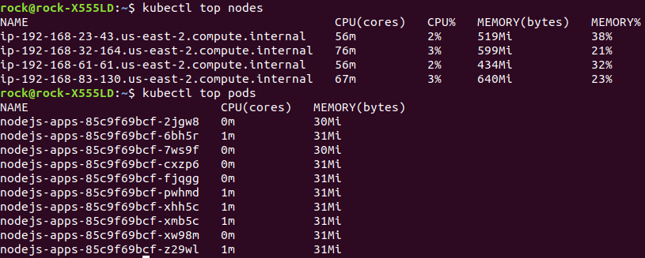

# EKS-with-Autoscale

## Getting Started setup EKS cluster on AWS

First of all setup EKS by writing cluster.yaml file and run it with following command

``` kubectl apply -f cluster.yaml ```

**OUTPUTS**


Setting metrics server in kubernetes for checking CPU and Memory usage using this link 

``` kubectl apply -f https://github.com/kubernetes-sigs/metrics-server/releases/download/v0.3.7/components.yaml ```


After that run Deployment and service Mainfest file by these coomand 

``` kubectl apply -f deployment.yaml ```

``` kubectl apply -f service.yaml ```

Then run HPA (Horizontal Pod Autoscaler) file for CPU and Memory Mainfest file.
 
``` kubectl apply -f hpa-cpu.yaml ```

``` kubectl apply -f hpa-memory.yaml ```

**OUTPUTS FOR CPU AND MEMORY UTILIZATION**


