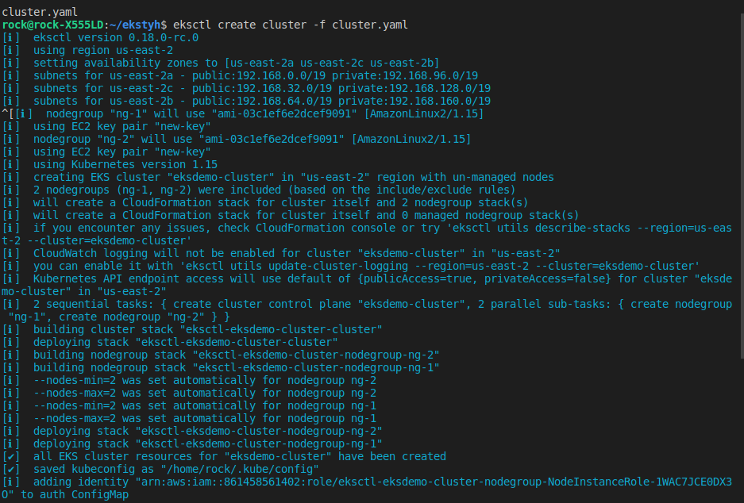
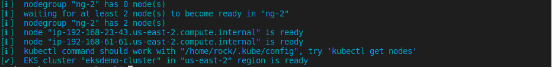

# EKS-with-Autoscale

## Getting Started setup EKS cluster on AWS

First of all setup EKS by writing cluster.yaml file and run it with following command

``` kubectl apply -f cluster.yaml ```

### OUTPUTS



